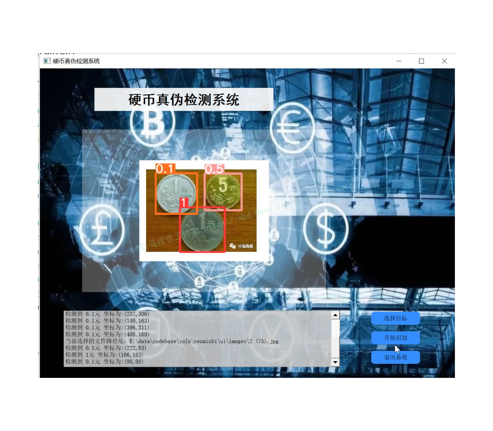
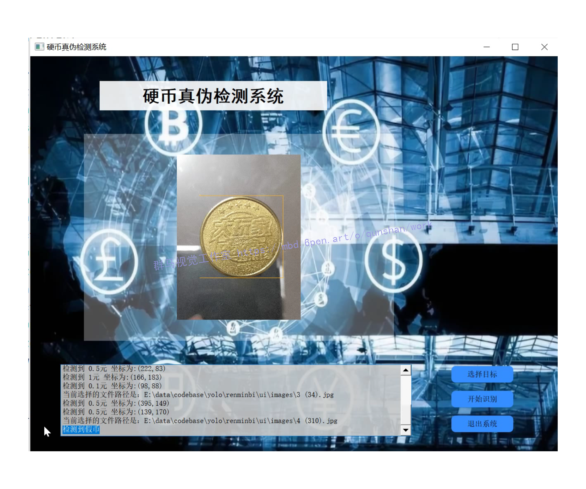
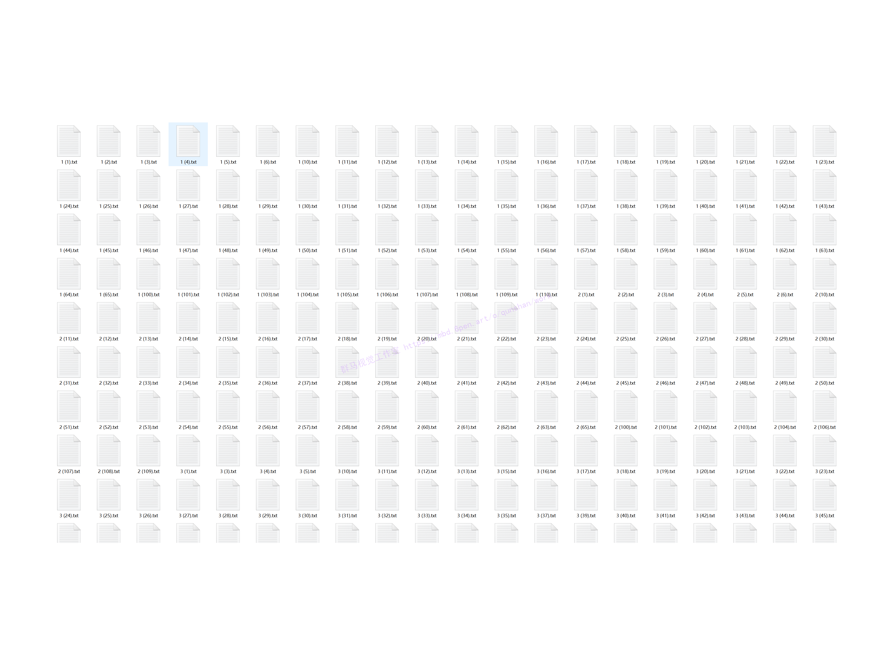
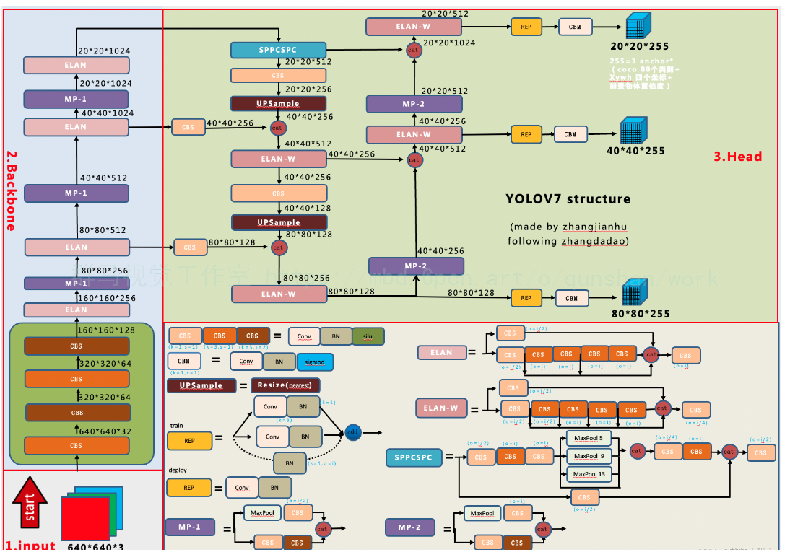
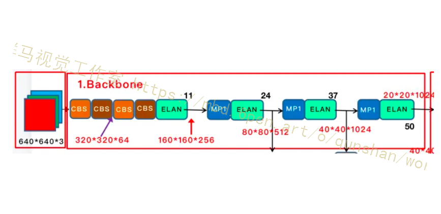
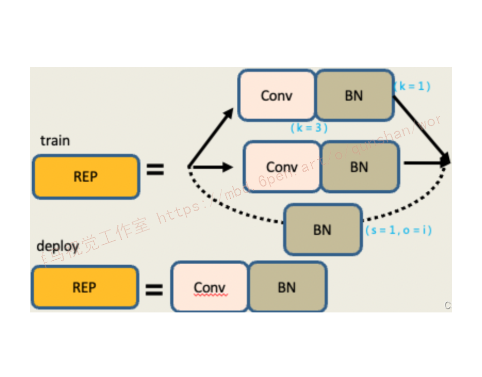
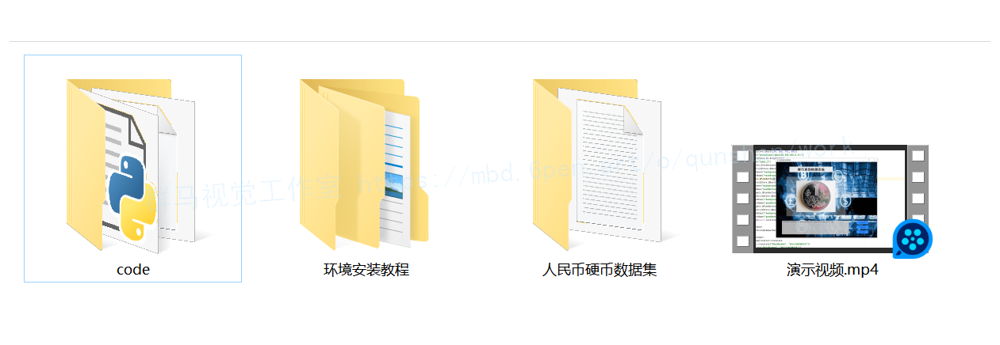

# 1.研究背景
硬币自动分类技术在多种系统和设备中都起到了关键作用，例如：自动投币系统、自动售票系统等等。由于硬币各种旋转角度和输入模式的广泛变化，硬币分类是人工智能及计算机视觉领域中一个极其困难的过程。硬币光面区域的存在是硬币输入模式广泛变化的原因，主要包括两种：镜面反射及光面区域磨损划伤。硬币表面质量参差不齐，对于表面质量较好的硬币，硬币光面区域存在镜面反射，使得拍摄的硬币图像具有不同的视觉特征，呈现多样性；其次，随着硬币的流通使用，硬币光面区域会产生划痕甚至变得模糊不清。

# 2.图片演示

# 3.视频演示

[基于YOLOv7的硬币真伪检测系统（源码＆教程）_哔哩哔哩_bilibili](https://www.bilibili.com/video/BV1bR4y1R7m5/?vd_source=bc9aec86d164b67a7004b996143742dc)

# 4.人民币硬币＆假币数据集

# 5.YOLOv7算法
我们先整体来看下 YOLOV7，首先对输入的图片 resize 为 640x640 大小，输入到 backbone 网络中，然后经 head 层网络输出三层不同 size 大小的 **feature map**，经过 Rep 和 conv输出预测结果，这里以 coco 为例子，输出为 80 个类别，然后每个输出(x ,y, w, h, o) 即坐标位置和前后背景，3 是指的 anchor 数量，因此每一层的输出为 (80+5)x3 = 255再乘上 feature map 的大小就是最终的输出了。

#### 网络结构

# 6.算法优化
#### backbone

[骨干网络参考原博客结构，总共有 50 层](https://afdian.net/item?plan_id=94bf1f4859a111ed9d4e52540025c377), 我在上图用黑色数字把关键层数标示出来了。
首先是经过 4 层卷积层，如下图，CBS 主要是 Conv + BN + SiLU 构成，我在图中用不同的颜色表示不同的 size 和 stride, 如 (3, 2) 表示卷积核大小为 3 ，步长为 2。 在 config 中的配置如图。

#### REP模块
[参考博客引入REP模块](https://mbd.pub/o/bread/Y5malppt)分为两个，一个是train，也就是训练，一个deploy，也就是推理。
训练模块，它有三个分支。
最上面的分支是3x3的卷积，用于特征提取。
中间的分支是1x1的卷积，用于平滑特征。
最后分支是一个Identity，不做卷积操作，直接移过来。
最后把它们相加在一起。
推理模块，包含一个3x3的卷积，stride(步长为1)。是由训练模块重参数化转换而来。
在训练模块中，因为第一层是一个3x3的卷积，第二层是一个1x1的卷积，最后层是一个Identity。
在模型从参数化的时候，需要把1x1的卷积啊，转换成3x3的卷积，把Identity也转换成3x3的卷积，然后进行一个矩阵的一个加法，也就是一个矩阵融合过程。
然后最后将它的权重进行相加，就得到了一个3x3的卷积，也就是说，这三个分支就融合成了一条线，里面只有一个3x3的卷积。
它们的权重是三个分支的叠加结果，矩阵，也是三个分支的叠加结果。

# 7.系统整合
[下图源码＆环境部署视频教程＆数据集＆自定义UI界面](https://s.xiaocichang.com/s/97c534)

参考[博客《基于YOLOv7的硬币真伪检测系统（源码＆教程）》](https://mbd.pub/o/qunma/work)

# 8.参考文献
[1]赵静,邱海飞,段航波,等.自动硬币分点装置设计与样机研制[D].2019
[2]邓成.基于螺旋振动上料的硬币清分机设计[D].2018
[3]李井元,方黎勇,胡栋材,等.基于变换矩阵的BGA X-ray图像倾斜识别 及校正方法[D].2018
[4]师平.一种检测金属表面划痕的多尺度多方向形态学方法[D].2016
[5]宋迪.基于机器视觉的手机隔板划痕检测研究[D].2014
[6]Alexander J, Ratner,Henry R, Ehrenberg,Zeshan, Hussain,等.Learning to Compose Domain-Specific Transformations for Data Augmentation.[J].Advances in neural information processing systems.2017,30(Spec ).3239-3249.
[7]Parsa, Seyyedeh-Sahar,Sourizaei, Mohamad,Dehshibi, Mohammad Mahdi,等.Coarse-grained correspondence-based ancient Sasanian coin classification by fusion of local features and sparse representation-based classifier[J].Multimedia tools and applications.2017,76(14).15535-15560.DOI:10.1007/s11042-016-3856-6.
[8]LeCun Yann,Bengio Yoshua,Hinton Geoffrey.Deep learning[J].Nature.2015,521(7553).436-444.DOI:10.1038/526050a.
[9]Russakovsky, Olga,Deng, Jia,Su, Hao,等.ImageNet Large Scale Visual Recognition Challenge[J].International Journal of Computer Vision.2015,115(3).211-252.DOI:10.1007/s11263-015-0816-y.
[10]Lu Chih-Cheng,Chang Wen-Liu,Wang Chih-Chen,等.A statistical pattern analysis approach for rapid coin identification based on Eddy-current sensors[J].Procedia Engineering.2011.5579-5583.DOI:10.1016/j.proeng.2011.08.1035.

---
#### 如果您需要更详细的【源码和环境部署教程】，除了通过【系统整合】小节的链接获取之外，还可以通过邮箱以下途径获取:
#### 1.请先在GitHub上为该项目点赞（Star），编辑一封邮件，附上点赞的截图、项目的中文描述概述（About）以及您的用途需求，发送到我们的邮箱
#### sharecode@yeah.net
#### 2.我们收到邮件后会定期根据邮件的接收顺序将【完整源码和环境部署教程】发送到您的邮箱。
#### 【免责声明】本文来源于用户投稿，如果侵犯任何第三方的合法权益，可通过邮箱联系删除。